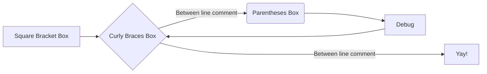
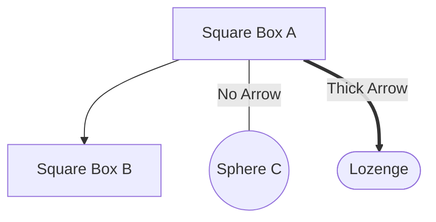

# **Hello World**

## **Hello h2** 

### **Hello h3** 

#### Hello h4 

##### Hello h5 

###### Hello h6 

---

Paragraphs 

```
Codes looks like thism
```

|Table | Notes | Mor Notes|
|:---|:---|:---|
| 1 | some stuff | rubbish |

Adding more stuff to see it it changes 

---
### Diagrams 




##### Another Top to Bottom Graph.



##### And a lot more on the Mermaid JS website docs.
