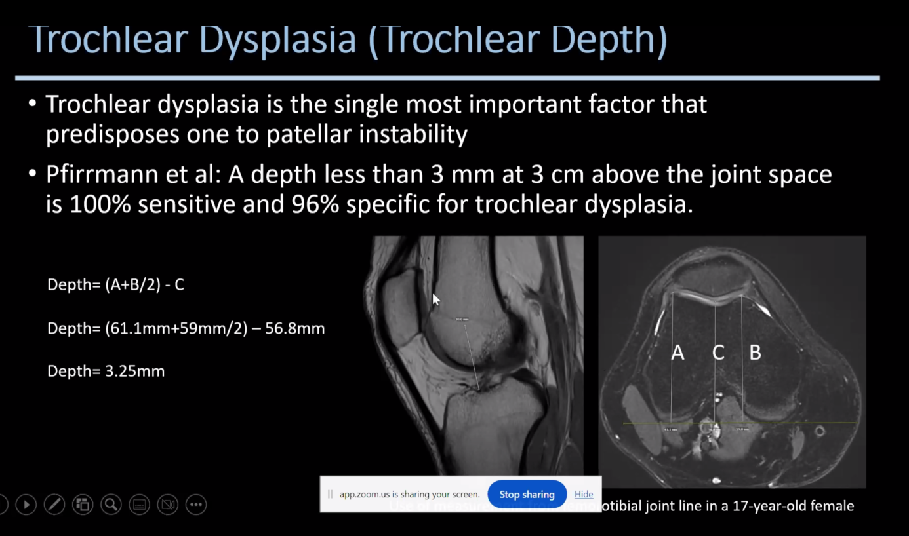
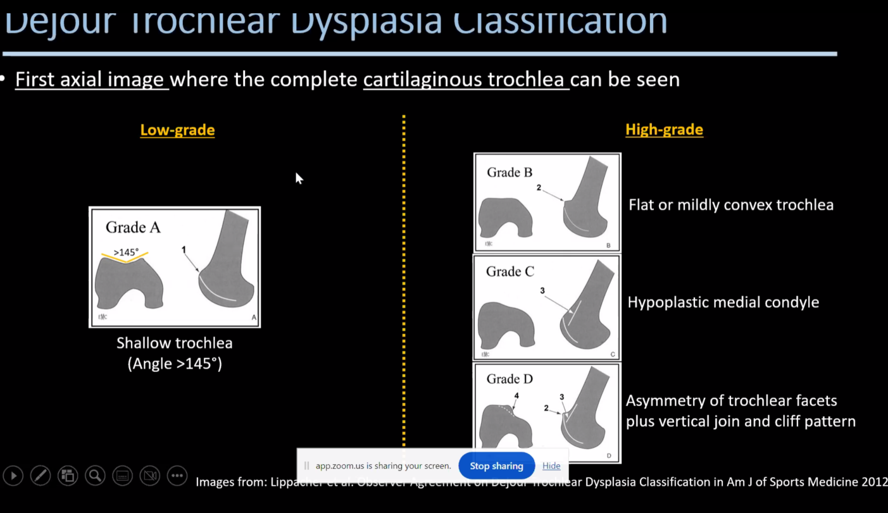
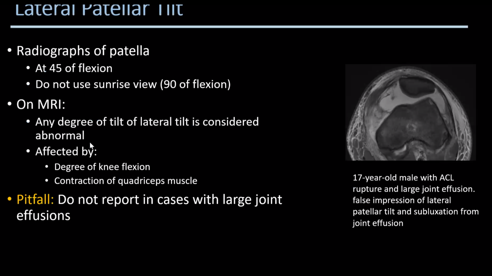
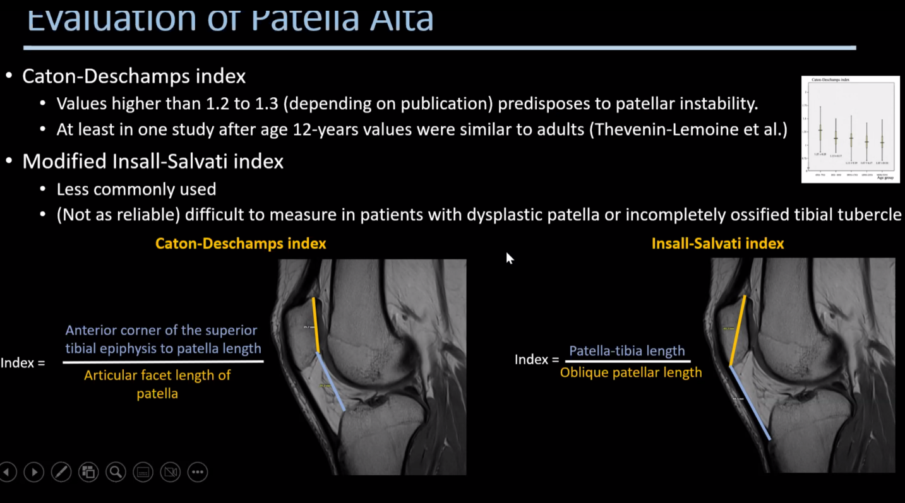
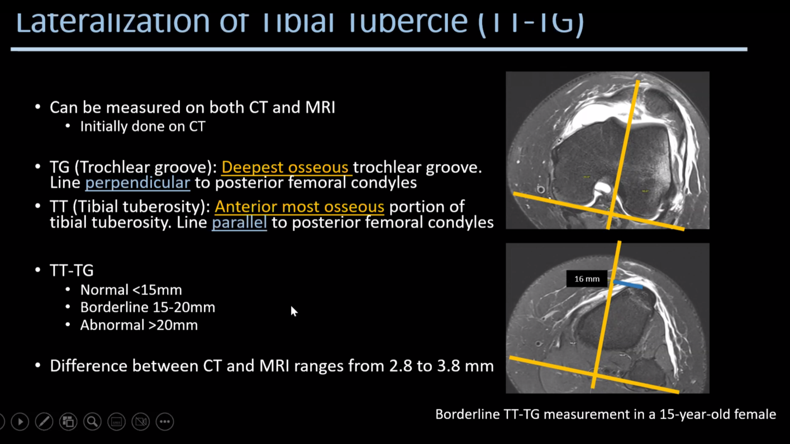
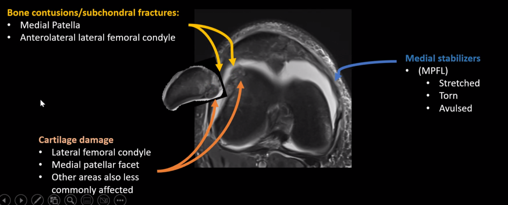
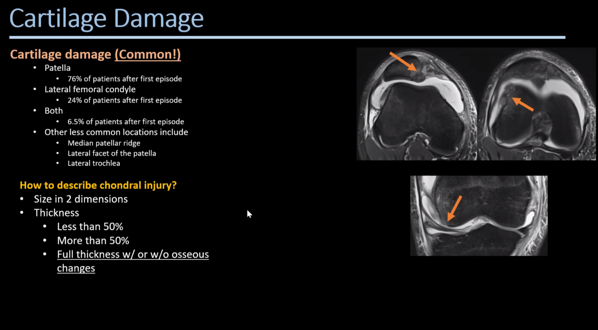
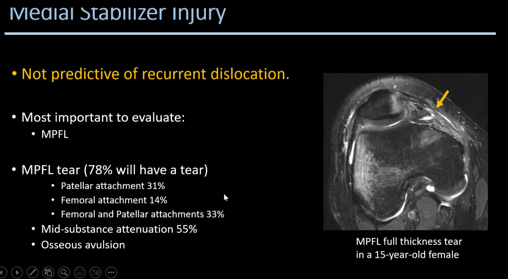

# Patella Maltracking 

[^Delgardo2024]: Jorge Delgardo, Lecture at SPR 2024   

## Anatomy and Basics  

Stability is provided by **Osseous** and **Soft tissue** structures  

#### Osseous  
Patella and Trochlear groove congruency (trochlear dysplasia).  
Tibial Tuberosity lateralisation.  

#### Soft Tissue   
Stabilised by 4 lateral and 4 medial stabilisers  
**but** only 2 are important :
**Medial patellofemoral ligament (MPFL)** and
**Lateral patellofemoral ligament (LPFL)**   

as only these 2 are visible on MR. 

> Retinaculum = fibrous tissue extending out from the patella  
> Ligaments here = Areas of thickening of the retinaculum  

## Radiological Assessment 
Multiple different systems. He says stick to:

1. Trochlear Dysplasia 
    1. Trochlear Depth 
    1. Dejour Classification 
    1. Lateral Trochlear Inclination 
2. Patella Tilt and Subluxation 
3. Patella Alta 
    1. Caton-Deschamps Index
1. Tibial Tuberosity Lateralisation 
    1. TT-TG 

### Trochlear Depth 

### Dejour Classification 

### Patella Tilt 

### Patella Alta 

### Tibial Tuberosity - Tibial Tuberosity Index 

*could do with writing this up in Jackdaw next time I have a case*

---- 

## Patella Dislocation and Cartilage Injury 

**Important to realise** that the best predictor of operative intervention is **Cartilage Injury** and not just bone bruising.  
And to realise that MPFL injury is not really important to classify accurately as reconstruction is much preferred to repair.  

-----

