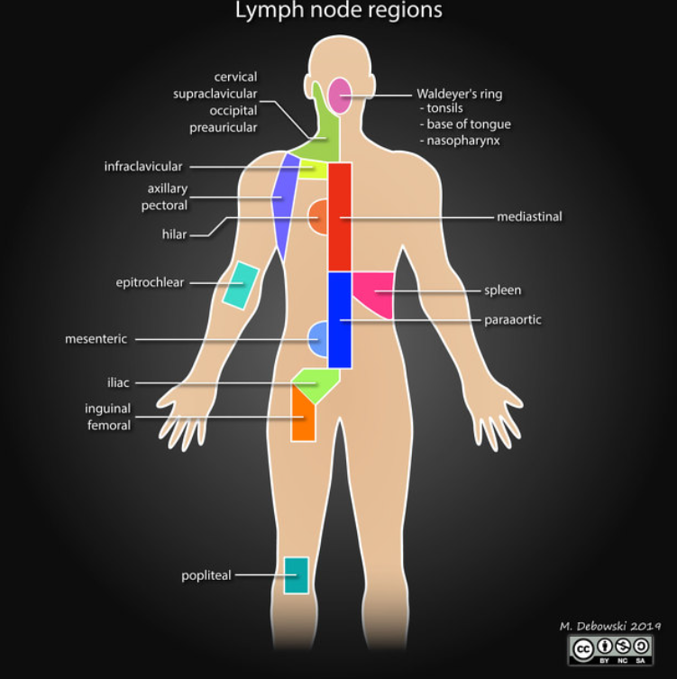

# Lymphoma 

## Nodal Stations  
as per Lugano Classification  

## Staging 

### Lugano Classification 

| Stage   | Description    |
|--------------- | --------------- |
| LIMITED Stage  |    |
| I   | Involvement of single lymphatic site (eg nodal region, spleen, Waldeyers ring)   |
| IE   | Single Extralymphatic site. No nodes.   |
| II   | Two or more nodal regions on the same side of the diaphragm.  |
| IIE  | Contiguous extralymphatic extension from a nodal site +/- involvement of other nodal regions on the same side of the diaphragm.  |
| II Bulky   | Can be limited or advanced stage depending on histo and prognostic factors. Maximum diameter of largest mass should be measured. HL: Mass >10cm or >1/3 thoracic diameter on CT. F-NHL: Mass >6cm. DLBCL: Mass >10cm |
| ADVANCED |    |
| III   | Nodal regions on both sides of diaphragm OR Nodes above the diaphragm and splenic involvement. |
| IV   | Diffuse / disseminated involvement >1 extralymphatic organ +/- nodal involvement OR Non-contiguous extra-nodal involvement with stage II nodal disease OR Any extralymphatic organ involvement in stage III disease. NB Includes any involvement of CSF, bone marrow, liver or lungs except by direct extension in stage IIE |  

> Waldeyers ring, thymus and spleen are considered nodal or lymphatic site.   
> Any liver involvement by contiguous or non-contiguous spread should be regarded as Stage IV disease.   
> 'B' classification is for HL only.

### St Jude Staging Classification for Paediatric NHL   

| Stage   | Classification    |
|--------------- | --------------- |
| I | Single tumour (extranodal) or Single nodal area excluding mediastinum or abdomen. |
| II | Single tumour (extranodal) with regional nodal involvement OR Two or more nodal areas on the same side of the diaphragm OR Two single (extranodal) tumours +/- regional nodal involvement on the same side of the diaphragm OR A primary GI tract tumour (usu ileocaecal) +/- associated mesenteric nodal involvement. |
| III | Two single tumours (extranodal) on opposite sides of the diaphragm OR Two or more nodal areas above and below the diaphragm.OR All primary intrathoracic tumours (including pleural) OR All extensive primary intra-abdominal disease.OR All paraspinal or epidural tumours regardless of other tumour sites. |
| IV | Any of the above with initial CNS +/- bone marrow involvement |  

## Prognostication. 
Adverse prognostic factors  

#### HL 

##### Early  
 - B symptoms 
 - Bulky mediastinal disease 
 - Mass >10cm on CT  
 - ESR >= 50
 - \> 3 or 4 nodal areas 
 - Extranodal lesions 
 - Age > 50

##### Advanced = International Prognostic Score (IPS) 
 - Serum albumin <4g/dl  
 - Hb <10.5g/dl 
 - Male sex  
 - Age \>= 45y 
 - Stage IV disease  
 - WCC \>= 15000 or <= 600/mm^2

#### DLBCL = International Prognostic Index (IPI)  
 - ECOG performance status >= 2 
 - Age >60  
 - Raised LDH  
 - Extranodal sites >= 2  
 - Stage III or IV  

> Revised - IPI (R-IPI) = Same criteria but better data for the Rituximab era.  
> NCCN-IPI = Stratifies Age & LDH.  
> Also Cell of Origin = Germinal centre type or Activated B-cell type.  

#### F-NHL = FL International Prognostic Index (FLIPI)-1  
 - \>= 3 nodal groups  
 - Raised LDH  
 - Age >60  
 - Stage III/IV  
 - Hb < 12g/dl 

##### or FLIPI-2  
 - Longest diameter of single site >6cm  
 - Raised beta-2-microglobulin.  
 - Bone Marrow involvement 
 - Hb <12g/dl  

## Clinical Features 

| Clinical Features    | Hodgkins    | NHL    |
|---------------- | --------------- | --------------- |
| Fever, night sweats, weight loss  | 40%    | 20%    |
| Spread  | Tends to be contiguous    | Multiple remote nodal groups often involved.  |
| Age  | Uncommon in childhood  | More frequent in 40-70ys    |
| **Nodal Groups** |   |     |
| Thoracic  | 75% | 35%  |
| Para-aortic  | 30% | 50%  |
| Mesenteric  | 5% | 55% |
| **Extranodal Disease** |   |     |
| CNS  | <1% | 2% |
| GIT | <1% | 10% |
| GUT | <1% | 10% |

