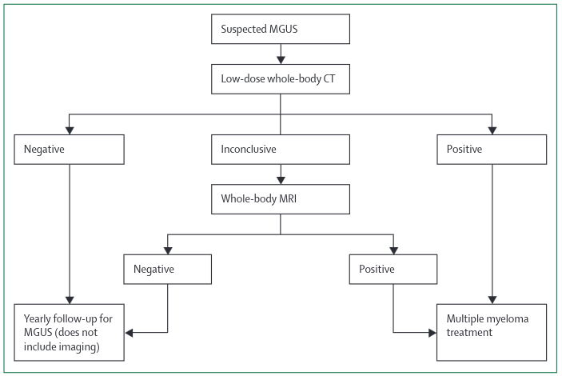
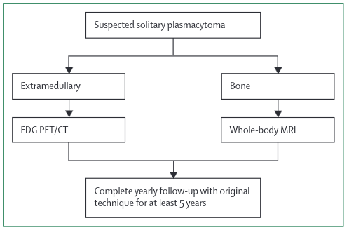
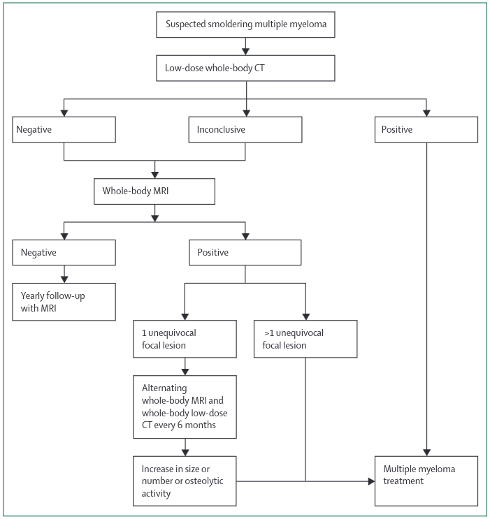
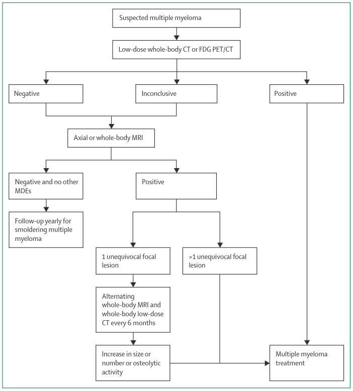
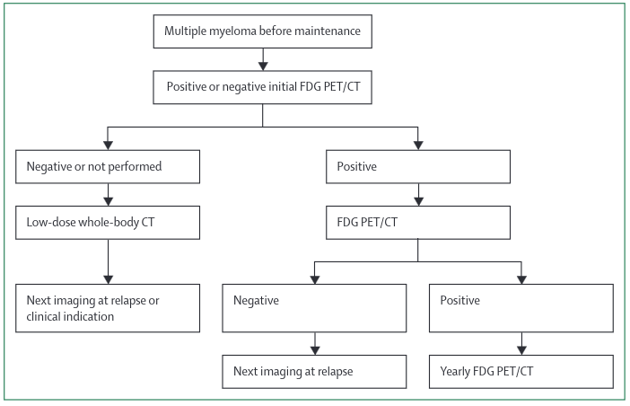
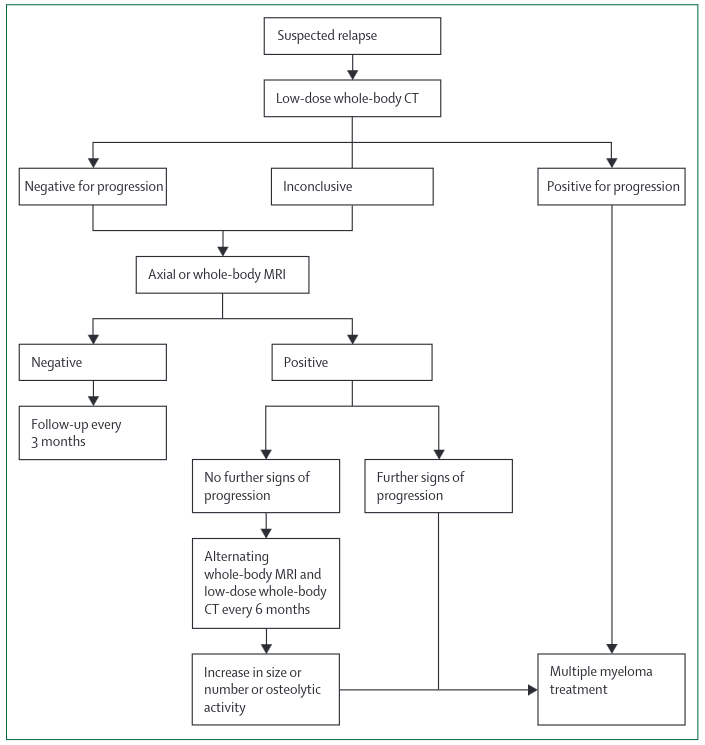

# Myeloma

## **Guidelines**

### International Myeloma Working Group Consensus Recommendations on Imaging in monoclonal plasma cell disorders 2019 [^IMWG2019]
[^IMWG2019]: Hillengass J et al. IMWG consensus recommendation on imaging in monoclonal... Lancet Oncol 2019; 20: e302–12 

#### Recommendations on the reporting of imaging results in monoclonal plasma disorders

#### First Diagnosis 
A radiological report on whole body imaging in patients with mpcd should include: 

- Infiltration and bone destruction pattern
    - Minimal (normal appearing)
    - Focal lesions
    - Diffuse infiltration and bone destruction
    - Mixed (focal lesions on diffuse background)
- Absolute number of focal lesions 
    - For WBMRI: 0, 1, 2-7 or >7 
    - For PET or WBCT: 0, 1-3 or >3 
- Number of fractures
    - New vs old 
    - Location 
    - Likelihood of malignant vs benign cause.
- Infiltration of long bones
- Evidence of surgical procedures in the skeletal system
- Incidental findings

#### In Remission 
Differentiate these findings with regards to response to therapy in imaging (guidelinespapers for WBCT, WBMRI and PET/CT)

- Response 
    - Normalisation of bone marrow signal in previously affected areas. 
    - Decrease in number and size of focal lesions.
    - Resolution of severely infiltrated bone marrow infiltrate into focal lesions.
    - Decrease in number and size of soft tissue tumours (paramedullary and extramedullary)
- No change 
- Progression 
    - Worsening of the diffuse bone marrow signal or new appearance of infiltration in previously unaffected areas. 
    - Increase in number and size of focal lesions. 
    - Merging of focal lesions into severely infiltrated bone marrow.
    - Increase in the size or number of soft tissue tumours. (paramedullary and extramedullary)

**Specifics for MRI**  
Cystic or liquid transformation of focal lesions after therapy. 

#### MGUS 

 

MGUS is 5% of 70 yr old.  
**Risk Factors for Progression to MM ( Southeastern Minnesota Cohort ) in non-IgM paraproteinaemia.**
*IgM mostly develops into Waldenstroms so does not need imaging* 

1. M-protein of >= 1.5g/dl 
2. Abnormal free light chain ratio.  

20yr progression to MM risk is 7% with zero risks, 20% with one risk factor and 30% with two factors.  
MRI in this group has approx 10% yield but no histo confirmation in studies thus false-positive risk.  
Recommend CT first especially. MRI for equivocal CT or non-secretors. No follow up imaging unless symptoms or serological markers suggest MM. 

#### Solitary Plasmacytoma

 

#### Smouldering Multiple Myeloma

 

#### Multiple Myeloma

 

 

 

---

### NICE Guidelines 2016 [^NICE2016]  

#### ***1) Imaging for Suspected Myeloma***  

**WB - MRI at First Diagnosis**   

> Offer imaging to all people with a plasma cell disorder suspected to be myeloma.  
> Consider whole-body MRI as first-line imaging.  
> Consider whole-body low-dose CT as first-line imaging if wholebody MRI is unsuitable or the person declines it.  

  1. Markov model assumes S/S of 1 / 0.95 despite the only study in the analysis which has full peformance data (which are the 2 largest) quoting figures of 0.63 / 0.72 for focal disease and 0.61 / 0.62 for diffuse disease. Why use such ridiculous figures plucked from nowhere?   
  > *"From the GC’s clinical experience and supported somewhat by low quality evidence MRI was assumed to be the most
  > diagnostically accurate, in terms of both sensitivity and specificity."*  p71 of Full Guidance
  - But guideline committe's experience of patients >70 is next to zero. 
  2. Resource costs are non-representative   
   
   | Procedure   | Cost |
   | :---------- | ---: |
   | Skel Survey | £108 |
   | WB-MRI      | £203 |
   | Spine MR    | £199 |
   | WB-CT       | £147 |
   | PET-CT      | £605 |

  3. The cost-effectiveness analysis does not entirely back up the conclusions as only if QUALY willingness to pay >£20K was WB MRI better than CT. And in the write up they state that the lack of decent economic and head to head diagnostic data makes it difficult to be sure which is better.  But the write up states that MR is the preferred technique = why? 
 
  4. State that the cost-effectiveness is dependent on the reduction in follow up cross-sectional imaging = But we rarely used this!

> For people with newly diagnosed myeloma or smouldering myeloma who have not had whole-body imaging with 1 of the following, consider whole-body imaging to assess for myeloma-related bone disease and extra-medullary plasmacytomas with one of:  
>  MRI  
>  CT  
>  fluorodeoxyglucose positron emission tomography CT (FDG PET-CT).  

#### **2) Imaging later in Disease**  

> Consider symptom-directed imaging for people with myeloma or smouldering myeloma if any new bone symptoms develop. 
> 
> For people with myeloma and serological relapse or disease progression, consider one of the following (taking into consideration previous imaging tests):  
>  whole-body MRI  
>  spinal MRI  
>  fluorodeoxyglucose positron emission tomography CT (FDG PET-CT).  
>  
> For people with smouldering myeloma and disease progression, consider one of the following (taking into consideration previous imaging tests):  
>  whole-body MRI  
>  whole-body low-dose CT  
>  whole-body CT  
>  spinal MRI  
>  fluorodeoxyglucose positron emission tomography CT (FDG PET-CT).  

But p268 states 
> "no studies were identified that investigated follow-up protocols for patients with myeloma so no evidence was found on any of these outcomes."   [^NICE2016]

The write-up points out the paucity of data here then discusses that SS are no good really but then comes up with the above recommendations which is odd as in the same secton they quote the papers they use in a table and in it:  
  - 3 x studies of WB-MRI in relapse / PD, each with n=30  patients  
  - 1 x study of WB CT in detecting relapse / PD with n=439  
  - CT S/S = 0.995 / 0.96 whilst WB-MRI = 0.82 / 0.62   
  - **No** mention of what it is trying to do, given the definition of PD/relapse is mostly non-imaging.    

> "*Whilst there were potential cost implications of making recommendations in this area, other questions in the guideline were agreed as higher priorities for economic evaluation.*"  

[BJH Guidelines on Imaging in Myeloma](https://onlinelibrary.wiley.com/doi/pdfdirect/10.1111/bjh.14827)

---

## **Clinical**

### What does Diffusion Weighted whole body imaging do in Myeloma? 
  1. Diagnose Myeloma. 
  2. Stage Myeloma. 
  3. Prognosticate Myeloma.
  4. Assess need for treatment (similar to above) = 'Activity assessment'
  5. Assess disease response. 
  6. Assess need for treatment in chronic patient. 
  7. Define which treatment. Chemotherapeutically.
  8. Define which treatment. Local treatments. 

For each of the above one would have to demonstrate that MR is BETTER than standard techniques and that the additional resource is beneficial. 
This would include CT scan as this is cheaper and more likely to be 

--- 

## **Radiological**

### ADC Values [^Messiou2019]

Not yet part of the standard. But,  
Normal bone marrow usually BELOW 600-700 um2/sec.  
Viable tumour usually ABOVE 700 um2/sec UPTO 1400.   

--- 

## **Papers**

[^Messiou2019]: Messiou C et al, Guidelines for Acquisition, Interpretation and Reporting of Whole-Body MRI in Myeloma. MY-RADS Radiology 2019; 291:5–13 • https://doi.org/10.1148/radiol.2019181949 •

[^BAH2016]: (https://onlinelibrary.wiley.com/doi/pdfdirect/10.1111/bjh.14827)  

[^NICE2016]: NICE Guidelines on the Management of Myeloma. https://www.nice.org.uk/guidance/ng35/evidence/full-guideline-pdf-2306487277

[^Laubach2019]: Laubach J. Initial therapy in older patients with multiple myeloma. N Engl J Med. 2019;380(22):2172-2173. https://search.proquest.com/docview/2232193627?accountid=46767. doi: http://dx.doi.org/10.1056/NEJMe1904372.

[^Lai2020]: Lai AYT, Riddell A, Barwick T, et al. Interobserver agreement of whole-body magnetic resonance imaging is superior to whole-body computed tomography for assessing disease burden in patients with multiple myeloma. Eur Radiol. 2020;30(1):320-327. doi:10.1007/s00330-019-06281-x

[^NICE2016_2]: Cost-Effectiveness Analysis https://www.nice.org.uk/guidance/ng35/evidence/appendices-af-pdf-2306487278

[^Goldschmidt2016]: Goldschmidt N, Zamir L, Poperno A, Kahan NR, Paltiel O. Presenting Signs of Multiple Myeloma and the Effect of Diagnostic Delay on the Prognosis. J Am Board Fam Med. 2016;29(6):702-709. doi:10.3122/jabfm.2016.06.150393

[^Friese2009]: Friese C et al Leuk Lymphoma. 2009 March ; 50(3): 392–400. doi:10.1080/10428190902741471.

--- 

## References

