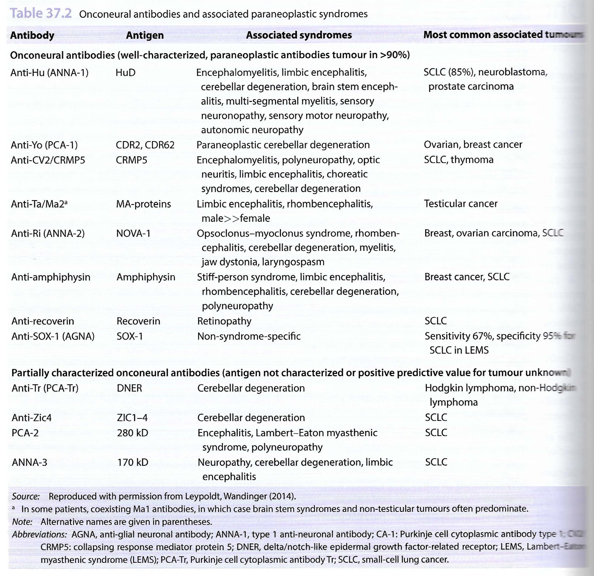

# Paraneoplastic Phenomenon. [^1] [^2]

[^1]: https://www.clinicalkey.com/#!/content/derived_clinical_overview/76-s2.0-B9780323755702006809 "Clinical Key" 

[^2]: Husband & Resnek Imaging in Oncology. 4e. 

## Neurological Paraneoplastic Syndromes 

Paraneoplastic neurological syndromes (PNS) = Remote effects of cancer that are not caused by tumour, mets, infection, ischaemia or metabolic disruption.  

Rare. \<1 in 10,000 with Ca. Commonly the presentation of the tumour but often the System review is positive.    
Immune mediated by 2 types of antibodies. 

Clinical Features  
- Subacute, progressive or consecutive involvement of different areas of NS. 

#### 1) ONCONEURONAL ANTIBODIES 

Are antibodies against intracellular Ag seen in both tumour and the nervous system.   
If positive on serology then very high PPV of having tumour. Thus needs Ix.  
But, poor prognosis, often refractory and relentless progressive.  

##### Tumours most often associated.   
- Lung esp NSCLC  
- Breast and Ovarian.  
- Testicular in young M. (anti-Ma)  

##### Common PNSs are   
1. Paraneoplastic Cerebellar Degeneration (PCD) 25%  
2. Paraneoplastic Limbic Encephalitis (PLE) 10% 
3. Paraneoplastic Encephalomyelitis (PEM) 6% 

#### 2) NEURONAL CELL-SURFACE ANTIBODIES  

Against receptors/proteins at synaptic or extra-synaptic neuronal cell membrane.   
Much more common but often not assoc'd with underlying tumours.  
> 40% of anti-NMDA receptor encephalitis have associated underlying tumours.   

### Antibodies and Syndromes  

 

### Types. 

| Name    | Path    | Radiology    | Other    |
|---------------- | --------------- | --------------- | --------------- |
| Limbic Encephalitis (LE)   | Both Onconeuronal Ab such as Anti-Hu in SCLC. And, Neuronal cell surface Ab.    | MRI +ve in 50%. Inc T2/FLAIR  Gd 0/+  ADC 0/+ |   |

