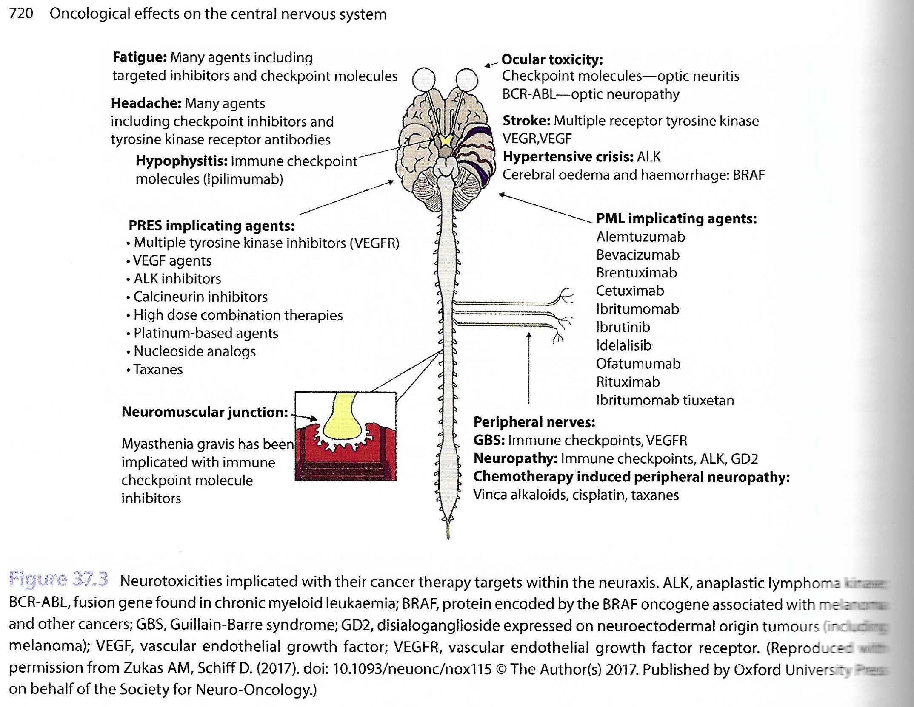

# Toxicity of Cancer Therapeutics 

## Terminology

#### Common Terminology Criteria for Adverse Events (CTCAE) 

- Grade 1 (mild): Asymptomatic or minimal. No intervention needed.  
- Grade 2 (moderate): Minimal, local or non-invasive intervention needed. Limiting ADLs   
- Grade 3 (severe): Hospitalisation or prolongation. Disabling, limiting self-care.  
- Grade 4 (life-threatening): Urgent intervention needed. 
- Grade 5: (fatal): RIP. 

## Neurotoxicity

**Lots of different pathways as outlined in this handy diagram**

 

> Note a lot of these are quite modern. 

### List of Neuro Disorders 

| Name    | Path     | Radiology     | Notes     |
|---------------- | --------------- | --------------- | --------------- |
| **Posterior Reversible Encephalopathy** PRES (1st=1996)  | **Causes:** Chemo/Immuno esp Tac + VEGF HT / Renal Dysfunction / Pre-eclampsia Sepsis Transplantation (solid & BMT) Haem Malignancy **Path:** Complex. Variation in BP overrides the cerebral autoregulation boundaries. Also endothelial dysfunction with CK release. Leads to extravasation and loss of BBB failures and on histo ranges from mild WM oedema to fibrinoid vascular necrosis with fibrin extravasation. 'Posterior' is due to relative lack of sympathetic innervation. | **MRI**: Mostly subcortical WM and vasogenic oedema. Parieto-occipital 99% Posterior Frontal 80% Temporal 70% Thalamic 30% Cerebellum 35% Brainstem 20% Basal Ganglia 10% [Unilateral in 2%] **ADC** 0/-. Low in 20% and is assoc with poor outcome. Haem 20% have macro but SWI =60%. Can be parenchymal or SAH Mostly reversible. | **CF:** Quite extensive Encephalopathy 55% Seizures 70% Headache 50% Visual Disturbance 33% Focal Neuro 10-15% Status 10% **Rx:** Supportive. Control of HT. Review Medication.  |
| **Progressive Multifocal Leukoencephalopathy** PML | **Path:** John Cunningham virus (JCV) demyelinating disorder **Aetiology:** HIV, Immume suppression and therapies.   Esp BMT, CLL, NHL and anti-CD20 (Ritux) **CF:** Progressive loss of mental functions. Confusion -> Focal neuro deficits, loss of motor, visual, speech and ataxia.  Weeks -> Months. | **Rad:** T2/FLAIR ++ in subcortical white matter involving ***u-fibres***. Anywhere and usually multifocal esp frontal and par-occ. Then moves deeper into centrum semiovale. Over time becomes large confluent lesions. Oedema 0 / Mass effect 0  Gd 0/+ (27%) - faint/patchy  ADC -/-- Edge of tumour | **Dx:** CSF for JC virus or Brain bx.  **Rx:** Difficult. Reverse immunosuppression. Some antivirals and immune stimulants. 
| **Hypophysitis** | **Causes:** Immune checkpoint inhibitors (ICI) esp. anti-CTLA4 = IPI in ~10% whilst anti-PD1 <1%.  Also produces other CNS syndromes ie encephalitis (non-spec CF & MRI), MS etc. | **Rad:** Inc Size of pit gland and stalk.  No involvement of optic chiasm. Gd ++  | **CF:** 6-12/52 post start  Headaches, fatigue, dizziness, memory impairment.  Ant Pit dysfunction (dec ACTH, TSH). But post pit is preserved.  qv Mets when DI is common.  **Rx:** Steroids and pit replacement.  | 
| **Cerebrovascular Disease**  CVD| **Path:** Increased risk due to hypercoagulability.  L-asparaginase => High risk of CVD and CST.  VEGF inhib (BEVA) => Ischaemic stroke, TIA, Haem stroke.  Small molecular kinase inhibitors lead to similar. BRAF kinase inhib (VEN/DABRA) in melanoma and are radiation sensitisors => Cerebral oedema and Haem. | | | 
| **Toxic Leukoencephalopathy**  aka MTX-induced Leukoencephalopathy | **Causes:** Many but especially methtrexate.  MTX-induced can be *acute* or *late*. And *transient* vs *permanent*  Seen in 4% of paed ALL. Both iv and i.t. implicated.  Other causes include 5-FU => 'Stroke-like' syndrome. | **Rad:** Variable and depends on agent and state.  MTX: T2++ in DWM.  5-FU: T2++/ADC-- in well-defined lesions in subcortical WM, corticospinal tracts & CC. But not in vascular territories Generally reversible post withdrawal so may not be a metabolic disorder.  *Delayed Toxic Leukoencephalopathy*: Diffuse hemispheric T2++/ADC0 and often asymptomatic | In MTX 20% of treated have mild changes on MRI but are symptomatic. | 
| **Toxic Myelopathy** | **Causes:** Intrathecal MTX | **Rads:** T2++ in dorsal columns | **CF:** Mimics SACD  Ascending motor weakness  Sensory loss Urinary and bowel incontinence  N B12 levels | 
| **Radiation** | **Path:**  Vascular abnormalities. Demyelination. WM necrosis. | 1) Acute = Days to Weeks. Now rare. Headaches and drowsiness. Steroid responsive.  2) Early Delayed = 1 to 6 months. Transient demyelination. Somnolence. Rads: Periventricular WM changes.  3) Late Delayed = >6/12. Radiation necrosis. Rads: Focal or multifocal WM oedema +/- Gd +/0 in RT bed. OR, white matter lesions with vascular abn, demyelination and then WM necrosis developing from PV WM into DWM and subcortical WM. No mass effect / ADC. Generally slowly progressive. | **CF:** Progressive memory, attention, exec fn deficits.  From 4/12 on  ~70% of LT RT survivors. MRI can be normal on structural imaging and only seen on DTI. | 
| **Sterotactic Radiosurgery** SR. Includes gamma knife or cyber knife | **Path:** Radiation necrosis peaking at 9-12 months post procedure. | **Rads:** Vasogenic oedema with mass effect and possible enhancement DD = Recurrence.  | **CF:** No one quite sure about the best approach to take here. ??perfusion imaging ?? PET. Or just follow up or biopsy. | 
| **Haemorrhagic Radiation Effects** | **Path:** Microvascular damage Also cavernomas | **Rad:** SWI lots of dots | |
| **Secondary Tumour** | Especially in childhood RT 7-10x Risk. 1-25% risk.| | Generally from 5yrs post for Gliomas and from 15ys for meningiomas |

---- 

## Chest Toxicities 

### Radiation

| Name    | Path    | Radiology    | Notes    |
|---------------- | --------------- | --------------- | --------------- |
| **Radiation Pneumonitis** | **Histo:** No pathognomic features and is essentially similar to DAD. ~ organising alveolar disease wit fibroblast proliferation and fibrosis.  | **Rad:** Usually sharply marginated ground glass to consolidation then fibrosis. ***CT:*** 4 patterns generally following increasing dose: Homogeneous GG -> Patchy Consolidation -> Discrete consolidation -> Solid consolidation with TB. GG can be seen by 2-3 weeks on CT.| **CF:** Most asymptomatic (20% of total only have signs on XR) but cough, fever and SoB. Presents at 6-8 weeks post RT and peaks at 3 - 4/12.  |
| **Radiation Fibrosis** | Path: Seen in essentially all therapeutic dose patients Becomes clear from 3/12 and increases to 12/12 | **Rad:** Defined by the bounds of the field (mostly) Strand-like with TB and volume loss. +/- Mild pleural thickening. ***Conformal 3D RT:***Produces 1 of 3 patterns 1. Mass-like appearances surrounding tumour. 2.Modified Conventional post RT changes but sometimes with peripheral sparing. 3.Scar-like <= 1cm fibrosis as a thin-band. | **Other:** Can also see - Hyperlucency of aerated lung - Spontaneous pneumothorax - Calcification in LN and thymic cysts | 
| **Radiation & Chemo Combination**  | ***Radiation Sensitisers:*** Produce earlier and generally worse disease and include Actinomycin D, Adriamycin, Bleomycin, Cyclophosphamide, MitoC and Vincristine. ***Parenchymal Agents*** Some chemo agents that produce lung disease have the disease worsened by RT. Includes Bleomycin, Busulphan and MTX  | **Rad:** Variable but includes alveolar infiltrates and reticulonodular patterns often leading to fibrosis. | | 

#### Heart 
Leads to small and medium vessel damage and thrombosis leading to parenchymal Fibrosis. 

Can lead to: 

- Acute and chronic pericarditis.  
- CAD (RIP inc'd by 10 to 15yrs)
- Valvular dysfunction (*esp MVR and AVR*).
- Cardiomyopathy (Dilated, Restrictive, Hypertrophic)
- Conduction abnormalities (eg QT prolongation)

#### Oesophagus 
More of a problem with intense dose regimes and with other agents.   

Can lead to ***Radiation oesophagitis*** but CF of this and other effects include: 

- Dysmotility (most common)
- Mucosal oedema 
- Ulceration & Fistula 
- Stricture   

Also Squamous cell Ca oesophagus. Mean = 14ys post.

#### Bone and Soft tissue Sarcoma. 

<= 1 in 1000 px living 5ys post RT.   
Mean = 10-15ys but range = 2 to 55 ys post. 
Bone = Osteosarcomas. Soft = Undifferentiated plexiform sarcoma. 

Also post RT Osteochondromas  
- Common ~ 10% of kids. 

### Chemotherapy Effect in Chest  

#### Drug Induced Pneumonitis   

a) **Immune Checkpoints Inhibitors** 
Pneumonitis in 5%   
CT = Variable. Ranging from AIP/ARDS (severe end) to COP / Hypersensitivity Pneumonitis / NSIP (milder end).   
CF = Severe end up in ITU whilst mild = Steroids. 

b) **Molecular Targets**  
eg mTOR inhib, eGFR inhib, ALK inhib, anti-CD20.  
In up to 25% but only 2% severe.   
CT = Again range from AIP/ARDS(Severe) -> Hypersensitivity Pneumonitis.   

c) **Pleural Effusion**  
Dosatinib.   

d) **Others:** 
Rarer.  
Pulmonary oedema, PTX (mostly in Rx'd sarcoma), Pulmonary haem (beva), Sarcoid-like granulomatosis seen with IPI/NIVO  

#### Drug Induced Cardiotoxicity 
Both old and new agents.  
Wide range of abnormalities including LV dysfunction, dilated CMP, HT, CAD, myocarditis, arrhythmia, pericarditis, effusion. 

a) **Anthracyclines** = Prototypical  
3-5% at 400mg/m^2 but 30% at 700mg/m^2 cumulative.  
=> Myocyte damage via several pathways.   

b) **Other Chemo**   
include Cap, 5-FU, Cyclophosphamide, Taxanes.  

c) **Other newer agents**   
include Tras, Pert, Beva, Sunit Soraf, Imi. 

Assessment often complicated and multimodal including MR and 3D Echo. 

---- 

## Abdominopelvic Toxicities 

### **HPB** 

#### Chemotoxicities 

Liver  
1. Steatosis = most common. Less often => CASH (Chemotherapy associated steatohepatitis)  
    - or Sinusoidal Obstruction Syndrome.   
2. Pseudocirrhosis = esp breast ca mets.    
    - can get caudate enlargement, ascites and splenomegaly.  
    - Path = nodular regeneration and no cirrhosis. 
3. Hepatic VOD = esp BMT with myeloablation. Usu <1/12 post.  
4. Drug-related Toxicity.   

#### Radiation Changes  

1. **Liver** = not common.   
    - Can get Radiation-induced liver disease RILD with >20-30 Gy total or >70 Gy for partial conformal.  
2. **Spleen** = v radiosensitive. 
    - 4-8 Gy => destruction of all lymphoid tissue.   
3. **Pancreas**   
    - Chronic pancreatitic like changes. 
    - Acinar epithelium more sensitive than the islet cells.   

### **GI** 

#### Chemotoxicities 

1. **SB wall thickening** = common and usually no other rad features.  
2. **Enteritis**  
    - Diffuse vs focal (esp TI) 
    - Hyperaemia, target sign of submucosal oedema.  
    - Inc risk with FOLFIRI and IRIN.   
3. **Neutropenic Enterocolitis**  
    - Chemo induced mucosal injury and secondary superinfection.   
    - Typhlitis = Localised version only in caecum. 
4. **Pneumatosis Intestinalis**
    - Asymptomatic or assoc'd with bowel perforation. 
    - Esp anti-angiogenesis = BEVA (1-5%)
5. **Late onset anastomotic breakdown** 
    - >1yr post op. 
    - BEVA again.  
6. **Peritoneal fluid**  
    - Usu small volume. 
    - Imatinib, IPI, DOC 

#### Radiation Changes  

1. **Stomach & Duodenum**  
    - Acute ~ PUD. Chronic => Fibrosis and GOO etc.  

2. **Small Bowel**  
    - Most RT sensitive part of the GIT.  
    - Tend to avoid getting high dose by mobility but this is lost if there are lots of adhesions.  
    - Early = Oedema. Occ obn which resolves conservatively.  
    - Late = Chronic AP, D, occ malabsorption, occ intermittent SBO   

3. **Colon & Rectum**  
    - Mostly in distal sigmoid and rectum. 
    - Eventually produces long, tapered strictures.  
    - CT = Thick wall and perirectal fat change with thickening of the perirectal fascia and with presacral fibrosis producing a mass like lesion.  

### **GU**

#### Chemotoxicities 

1. **Kidneys**   
    - Acute AKI or chronic nephrotoxicity which leads to atrophy and loss of cortex.   

2. **Bladder** 
    - Cyclophosphamide / Ifosamide => Haem cystitis.  
    - Intravesical immuno/chemo eventually leads to contracted fibrosed bladder.  

3. **Ovaries**
    - Atrophy with decd follicles. 
    - Uterus => post-menopausal appearance.    

#### Radiation Changes  

1. **Bladder** 
    - V. radiosensitive. 20% of pelvic RT get symptoms and 10% long-term.   
    - Acute = Mucosal bullous oedema, haemorrhage, necrosis.  
    - Chronic = Fibrosis and decd volume. Freq and Incontinence   

2. **Kidney** 
    - Dose limiting in abdominal RT. 

3. **Ureter**
    - Stricture - mostly in distal ureter. 
    - VUR.  

4. **Gynae**
    - Similar menopausal changes to chemo.   

5. **Testis**
    - very very radiosensitive. 

#### **Pelvic Radiation Disease**

Includes radiation enteritis, proctitis, cystitis.  
CF: D, tenesmus, incontinence, rectal bleeding.   
Has a higher incidence than Crohn.  
90% of pelvic RT patients get chronic CIBH with 50% reporting a significant dec in QoL.   

Timing:  

- Acute PRD : Immediate to 3/12.   
    - D, tenesmus, rectal bleeding  

- Chronic PRD : 6/12 to 3ys Progressive but can be 30ys later.   
    - Due to progressive ischaemia and fibrosis.  

- Delayed / Latent PRD : Starts yrs to decades later.   
    - Path Oxidative stress to nuclear DNA  

#### Second malignancy  

For Prostate RT: 1 in 70 >10yr survivors get a second tumour mostly rectal or bladder.   

For kids, 10% at 20ys. ~> lymphoma, sarcoma or leukaemia.  

