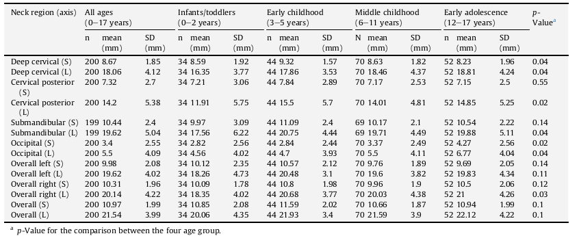

# Neck Lump or Masses (< 18yo)

## Ultrasound for Neck Masses <18yo 

Question: Is the lump a lymph node(s)? 

---

### If the lump is a lymph node. 

Consider:   
 1. Palpable lymph nodes are normal. [^Alves_Rosa2021] [^Paddock2020]  
 2. Persistent normal nodes are normal in children. [^Meadows2020]  
 3. Lymph nodes varying in size is normal.  
 4. US is of limited utility in differentiating the different causes of lymphadenopathy.[^Paddock2020]  
 5. If there are features suggestive of a lymphoma then please refer as per [NICE NG12](https://www.nice.org.uk/guidance/ng12/chapter/recommendations-organised-by-symptom-and-findings-of-primary-care-investigations#symptoms-in-children-and-young-people)  
 6. If the concern is leukaemia or other malignancy then please refer as per [NICE NG12](https://www.nice.org.uk/guidance/ng12/chapter/recommendations-organised-by-symptom-and-findings-of-primary-care-investigations#symptoms-in-children-and-young-people).  

If still wanting to refer then just guide to a non-ordered input.  

[^Meadows2020]: Meadows O, Sarkodieh J. Ultrasound Evaluation of persistent cervical lymph nodes in young children. Clinical Radiology 76 (2021) 315.e9e315.e12  
[^Paddock2020]: Paddock M, Ruffle A et al. Do otherwise well, healthy children with palpable cervical lymph nodes require investigation with a neck ultrasound. Arch Dis Child 2020;105:1012–1016. doi:10.1136/archdischild-2020-319648  
[^Alves_Rosa2021]: Alves Rosa J et al. Normal head and neck nodes in the paediatric population. Clinical Radiology 76 (2021) 315.e1e315.e7  

---

### If the lump is a not then a lymph node.

Use the usual non-ordered inputs.

--- 
 
## What is a Normal node in a child?[^Alves_Rosa2021]

Based on Cor T2 of 200 children having MR for other reasons, mostly headache.  
Largest nodes in each station were assessed *only on the coronal scans - thus not a proper SAD*. 

Results:   
 - 4% of population had measurable superficial cervical nodes. Mean SAD = 5mm, Max = 9mm.  
 - Even occipital nodes were mean SAD = 3 to 4mm.   
 - For most 'deep' nodal stations the **Mean SAD** was 10-12mm !! With the largest nodes being in 3-5y olds. 
